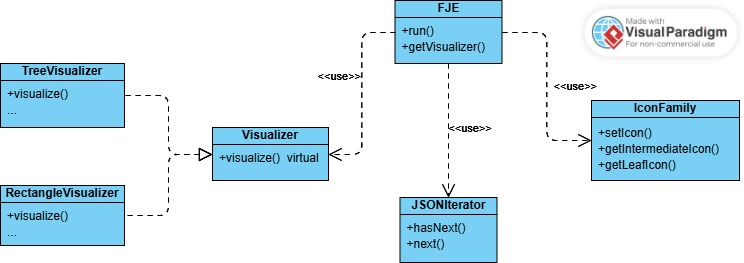
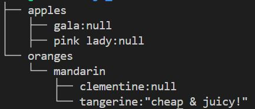
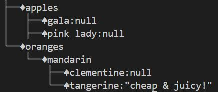
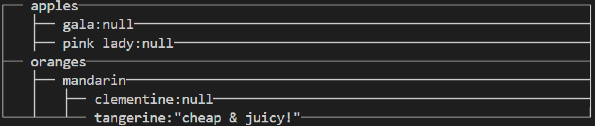
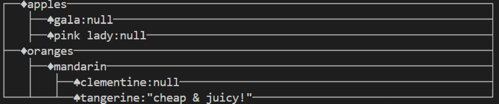

# Funny JSON Explorer设计模式实现

| 时间      | 学号     | 姓名   |
| --------- | -------- | ------ |
| 2024/6/19 | 21307333 | 洪俊东 |

## 实验要求

对已有FJE实现进行设计重构

改用迭代器 + 访问者模式，或者迭代器 + 策略模式。

## 实验步骤

采用迭代器 + 策略模式进行设计重构

### 迭代器模式

迭代器模式提供一种方法顺序访问一个聚合对象中的各个元素，而又不暴露其内部的表示。

- 在`json_iterator.h`中使用迭代器模式，将读取到的JSON文件存于自定义的数据格式，方便后面可视化时的读取。

### 策略模式

在策略模式定义了一系列算法或策略，并将每个算法封装在独立的类中，使得它们可以互相替换。通过使用策略模式，可以在运行时根据需要选择不同的算法，而不需要修改客户端代码。

- 在`visualizer.h`中定义策略接口，然后创建具体的策略类实现这个接口，即树形风格和矩形风格，分别位于`tree_visualizer.h`和`rectangle_visualizer.h`中。

## 实验结果

**TreeStyle+DefaultIconFamily**

**TreeStyle+PokerFaceIconFamily**

**RectangleStyle+DefaultIconFamily**

**RectangleStyle+PokerFaceIconFamily**

